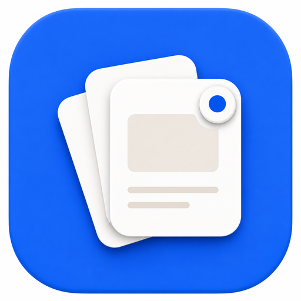

<div align="center">
  
  <h1>Tag</h1>
  <p><strong>Never lose the reason you saved something.</strong></p>
  <p>A local-first intention inbox that turns saved screenshots and notes into source-backed cards.</p>
  <p><strong>Tag is currently in beta.</strong> <a href="https://testflight.apple.com/join/yusxUSC6">Try in beta</a>.</p>
</div>

## Overview

People save screenshots, messages, emails, articles, and links because they may matter later. The hard part is remembering why they mattered and what action they implied.

Tag turns passive captures into useful, source-backed cards:

```text
Saved thing -> detected intention -> Tag Card -> action
```

The app is iOS-first, local-first, and built around private saved context. There is no account system, no backend, no cloud sync, and no telemetry by default.

## Demo

<p align="center">
  <a href="https://youtu.be/hwiTligAAxU" aria-label="Watch the Tag demo on YouTube">
    
  </a>
</p>

<p align="center">
  <a href="https://youtu.be/hwiTligAAxU"><strong>Watch the demo on YouTube</strong></a>
</p>

## What Tag Does

- Imports screenshots and images into local storage.
- Extracts useful text, deadlines, people, topics, and intent from saved sources.
- Creates Tag Cards for reminders, goals, read-later items, passive knowledge, and suggestions.
- Keeps cards tied to the original source so every recommendation can be inspected.
- Schedules local notifications only for active reminder or goal cards.
- Groups related sources and cards into Spaces.
- Lets you ask questions over saved context with source citations.
- Turns clusters of related learning resources into a guided plan after confirmation.

## Local-First Design

Tag keeps private context on device. SQLite, local files, local notification requests, source chunks, embeddings, chat messages, and processing jobs live in local app storage.

The core safety invariant is:

```text
The model proposes. The app validates. The user confirms where required.
```

AI output is treated as a proposal. App-side validators enforce card type, source evidence, Space ownership, notification eligibility, and confirmation requirements before anything changes user-visible state.

## Architecture

Tag is a Flutter app with feature-first modules:

```text
lib/
  core/
    ai/
    local_storage/
    navigation/
    notifications/
    platform/
    startup/
    theme/
  features/
    ai_processing/
    cards/
    chat/
    model_setup/
    onboarding/
    rag/
    source_ingestion/
    spaces/
    today/
```

Key technologies:

- `flutter_bloc` for state management.
- `get_it` for dependency injection.
- `go_router` for app navigation.
- Drift and SQLite for structured local data.
- Local file storage for source images and extracted artifacts.
- Local notifications for reminder and goal cards.
- Cactus-compatible local model orchestration for extraction, intent detection, embeddings, and retrieval workflows.

Model assets are not committed to this repository. The app is structured so local model setup can be handled on device without exposing private user data or requiring a backend.

## Running Locally

Prerequisites:

- Flutter SDK.
- Xcode.
- CocoaPods.
- An iOS simulator or a signed physical iPhone target.

Install dependencies:

```sh
flutter pub get
```

Run static checks and tests:

```sh
flutter analyze
flutter test
```

Build for an iOS simulator:

```sh
flutter build ios --simulator --debug
```

Run on an iOS simulator:

```sh
flutter run -d <simulator_id> --debug
```

Build an unsigned iOS release artifact:

```sh
flutter build ios --release --no-codesign
```

Physical iPhone release runs require Apple signing, provisioning, and Developer Mode:

```sh
flutter run -d <physical_device_id> --release
```

## Contributing

Issues and pull requests are welcome. Please read [CONTRIBUTING.md](CONTRIBUTING.md) before contributing and use the GitHub issue templates for bug reports, feature requests, and privacy/local-first concerns.

For security or privacy-sensitive reports, see [SECURITY.md](SECURITY.md). Do not post private screenshots, local databases, model files, signing material, or unredacted logs in public issues.

Before changing repository visibility or publishing a mirror, use the [public release checklist](docs/public_release_checklist.md).

## App Icon

The iOS app icon set and launch image are generated from the Tag icon artwork in `ios/Runner/Assets.xcassets`. README brand assets live in `docs/assets/brand/`.

## Privacy

Do not commit private screenshots, local databases, model weights, device containers, or generated testing artifacts. The `.gitignore` keeps local runtime data, model files, and artifact captures out of source control.

The public Xcode project should not include personal Apple signing assets. Contributors who need device builds should use their own Apple Team, bundle IDs, App Group, certificates, and provisioning profiles locally.

## Status

Tag is an iOS-first MVP. The product surface is intentionally focused: save context, recover intent, inspect evidence, ask grounded questions, and act on what matters.

## License

See [LICENSE](LICENSE) and [NOTICE.md](NOTICE.md).
